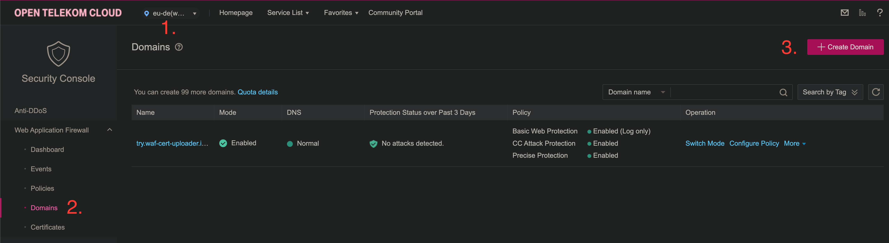
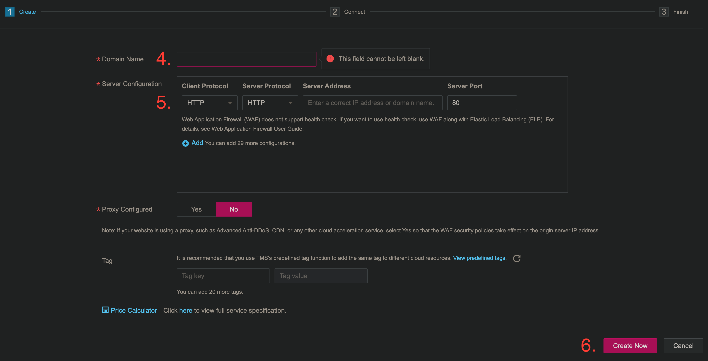

# WAF cert uploader

This service is a **Kubernetes Mutating Webhook**. It manages certificates for a set of given domain names and
attaches them to a [Web Application Firewall (WAF)](https://docs.otc.t-systems.com/web-application-firewall/index.html) in [Open Telekom Cloud (OTC)](https://open-telekom-cloud.com/).
It is intended to be used together with a set of **Kubernetes** resources and thus needs to be deployed via a [Helm Chart](https://github.com/iits-consulting/waf-cert-uploader/tree/gh-pages).
An example **Terraform** project using the chart can be found [here](https://github.com/iits-consulting/waf-cert-uploader-terraform).

# Helm chart for the [WAF certificate uploader](https://github.com/iits-consulting/waf-cert-uploader)

This documentation demonstrates how the **WAF certificate uploader** can be configured and deployed to manage certificates automatically in the WAF. The **Helm Chart** enables the process of generating and attaching certificates to the WAF depending on a given Kubernetes TLS secret.

## Requirements
### Kubernetes Cluster
In order to be able to use the webhook, a **Kubernetes Cluster** with the following components is needed:
- [**cert-manager**](https://cert-manager.io/docs/installation/) - needed to generate a self signed certificate so that the **Kubernetes API Server** can communicate with the webhook via https.
- [**waf-cert-uploader helm chart**](https://github.com/iits-consulting/waf-cert-uploader/tree/main/charts/waf-cert-uploader) - installs the webhook as well as its dependencies.
- [**Docker Pull Secret**](https://kubernetes.io/docs/tasks/configure-pod-container/pull-image-private-registry/) - a secret to be able to pull the **waf-cert-uploader** docker image from the given repository.
- [**Certificate Secret**](#deploy-a-certificate)- which will trigger an admission review if it's changed.
- **Ingress Controller** - e.g. [**traefik**](https://traefik.io/traefik/) or [**nginx**](https://www.nginx.com/).
### WAF Domain
Additionally, a **WAF domain** must be created in **OTC**:
- Select your OTC project.
- Open the service menu and search for WAF.
- Click on *Web Application Firewall*, then on *Domains* and then *Create Domain*.

  
- Specify your domain name and the IP address of your web server (only allow HTTP!), then click *Next*.

  
- Add the new CNAME record to your DNS provider, so it points the WAF IP address, click *Next* and then *Finish*, a default WAF Policy will be created.
- In the domains menu click on the name of your WAF domain and then copy the *Domain ID*.<br />It is needed for the [certificate deployment](#deploy-a-certificate) step.

This can also be achieved via **Terraform**:

```tf
resource "opentelekomcloud_waf_domain_v1" "domain" {
  for_each = {
    "my.domain.com" = your-elastic-loadbalancer-public-ip
  }
  hostname = each.key
  dynamic "server" {
    for_each = toset(each.value)
    content {
      client_protocol = "HTTP"
      server_protocol = "HTTP"
      address         = your-web-server-ip-address-here
      port            = 80
    }
  }
  tls       = "TLS v1.2"
  cipher    = "cipher_1"
  policy_id = null
  proxy     = false
}
```

## Helm chart configuration

The following table shows the most important configuration parameters of the helm chart:

| Variable Name                                  | Explanation                                                                                                | Example                        |
|------------------------------------------------|------------------------------------------------------------------------------------------------------------|--------------------------------|
| `otcAuth.otcAccountName`                              | **REQUIRED** The OTC account name                                                                  | `OTC-EU-DE-00000000`          |
| `otcAuth.projectName`                                | **REQUIRED** Your OTC project name                                                                          | `eu-de_your_project`          |
| `otcAuth.username`<br /> `otcAuth.password`          | **REQUIRED** IAM user credentials to be authenticated with OTC     |                                             |
| `imagePullSecrets`                          | **REQUIRED** List with names of docker pull secrets to inject into the deployment  |     <pre lang="yaml">[&#13;  {&#13;    name: "pull-secret-github" &#13;  }&#13;]</pre>                                                          |
| `image.repository`                          | **OPTIONAL** Repository, tag and pull policy of the webhook docker image  |   `docker.io/waf-cert-uploader`                                                       |
| `image.tag`                          | **OPTIONAL** Repository, tag and pull policy of the webhook docker image  |    `latest`                                             |
| `image.pullPolicy`                          | **OPTIONAL** Image pull policy  |    `Always`                                             |

## Example Chart
Deploy the **Helm Chart**. Go to `charts/waf-cert-uploader`, edit the `values.yaml` file and run:
```
helm install waf-cert-uploader .
```

The **Helm Chart** can also be deployed with **Terraform**:

```tf
resource "helm_release" "waf-cert-uploader" {
  name             = "waf-cert-uploader"
  chart            = "../../../charts/waf-cert-uploader-1.4.2.tgz"
  namespace        = "waf"
  create_namespace = true
  values = sensitive([
    yamlencode({
      replicaCount = 1
      otcAuth = {
        otcAccountName = "OTC-EU-DE-00000000"
        projectName    = "eu-de_my-project"
        username       = "my-username"
        password       = "my-password"
      }
      image = {
        repository = "ghcr.io/iits-consulting/waf-cert-uploader"
        pullPolicy = "Always"
        tag        = "latest"
      }
      imagePullSecrets = [
        {
          name = "pull-secret-github"
        }
      ]
    })
  ])
}
```

## Deploy a Certificate
After the **Helm Chart** is deployed, a TLS secret with the following annotation and label must be deployed to the cluster:
1. `waf-cert-uploader.iits.tech/waf-domain-id: "any-domain-id"`
2. `waf-cert-uploader.iits.tech/enabled: "true"`

Example:
```yaml
apiVersion: v1
type: kubernetes.io/tls
kind: Secret
metadata:
  name: oidc-forward-auth-cert
  annotations:
    waf-cert-uploader.iits.tech/waf-domain-id: "any-domain-id"
  labels:
    waf-cert-uploader.iits.tech/enabled: "true"
data:
  tls.crt: certificate-content-in-base64
  tls.key: certificate-key-in-base64
```

Alternatively, it is also possible to deploy a **cert-manager** certificate. The annotation and label are automatically transferred to a new secret after the certificate chain is received and stored.
```yaml
apiVersion: cert-manager.io/v1
kind: Certificate
metadata:
  name: my.domain.com
  namespace: waf
spec:
  secretTemplate:
    labels:
      waf-cert-uploader.iits.tech/enabled: "true"
    annotations:
      waf-cert-uploader.iits.tech/waf-domain-id: "any-domain-id"
  secretName: my.domain.com
  isCA: false
  privateKey:
    algorithm: RSA
    encoding: PKCS1
    size: 2048
  usages:
    - server auth
    - client auth
  dnsNames:
    - my.domain.com
  issuerRef:
    name: letsencrypt
    kind: ClusterIssuer
```
Now the cluster is set up. The webhook will upload the certificate to the WAF whenever the certificate secret is updated. The web server IP adress entry in the WAF will be duplicated to use HTTPS instead of HTTP for ingoing and outgoing requests. You should now be able to acces the WAF from your web browser via HTTPS.

# Implementation details
This section provides a comprehensive overview of the implementation details. In this scenario, the TLS domain certificate is automatically created and updated by *cert-manager*.

## Creation of resources in the **Kubernetes Cluster (CCE)**

 - The **cert-manager**, responsible for automating the certification process.
     - The **letsencrypt cluster issuer**, tasked with issuing the CNAME record `my.domain.com`.
     - The **selfsigned cluster issuer**, responsible for issuing the WAF cert uploader webhook, allowing the communication between the Kubernetes API Server and the webhook.
     - A **CA certificate** for each CNAME record, containing the corresponding WAF domain ID in the secret template section.
     - A **selfsigned certificate** for the webhook.
 - A **secret** containing OTC-Credentials and which is mounted into the webhook container.
 - A **service** (type ClusterIP) to make the webhook deployment accessible from within the cluster.
 - Deployment of:
     - The webhook, which uploads the certificates to the WAF.
     - Upon startup, the mounted credentials secret is used to create an authenticated [gopher provider client](https://github.com/opentelekomcloud/gophertelekomcloud) and a service client for API calls.
 - **Mutating Webhook Configuration**:
     - Informs the Kubernetes API Server of the events that will trigger an admission review.
     - In this scenario, the API Server monitors updated secrets<br>with the following label: `"webhook-enabled" : "true"`.
     - Directs to the webhook service and endpoint.
 - **Traefik** (Ingress controller)
 - **Kyverno** (for default iits policies)

## Certification Process
- The cert-manager identifies the unsigned certificates and generates the objects necessary for the acme challenge process.
- It then produces a key pair and stores the private key in the certificate secret named `my.domain.com`. The WAF domain ID and the match label from the mutating webhook configuration are also transferred to the secret.
- The public key is sent to letsencrypt and a challenge token is received and stored in a file hosted by a small web application.
- The Ingress controller redirects incoming requests from<br> `http://my.domain.com/.well-known/acme-challenge/<TOKEN>` to the pod containing the challenge token file.
- letsencrypt attempts to request the token on port 80. If successful, it encrypts the public key with its private key and attaches this signature to the public key.
- The cert-manager receives the certificate chain and stores it in the certificate secret.

## Webhook Triggering
- With the occurrence of an update event on a secret with the match label from the webhook configuration, the API Server sends an admission review object to the webhook.
- The admission review comprises the old secret without the certificate chain as well as the target secret with the certificate chain. The mutating webhook can now manipulate the secret and either accept or reject the admission review.

## Certificate Uploading Process
- The webhook extracts the certificate content, WAF domain ID, and WAF certificate ID (if it exists initially) from the admission review object.
- The certificate content undergoes SHA256 encryption to generate a unique identifier, which serves as the name for the certificate.
- A request is made to the WAF API to retrieve all existing certificates, initiating a search process. If the certificate name already exists in the WAF, the process is terminated, and the admission review is accepted without any mutation.
- If the SHA256 name is not found in the WAF, the certificate is uploaded, and a certificate ID is received.
- The received certificate ID is then attached to the WAF using the domain ID from the certificate secret.
- The WAF domain is updated with an additional server address entry, enabling automatic forwarding of incoming and outgoing requests to port 443, and the certificate is utilized.
- If a WAF certificate ID exists in the certificate secret, the previous certificate is considered expired and is subsequently deleted.
- The admission review is accepted, and the secret is mutated to include an additional annotation with the new certificate ID.

# Workflow chart


